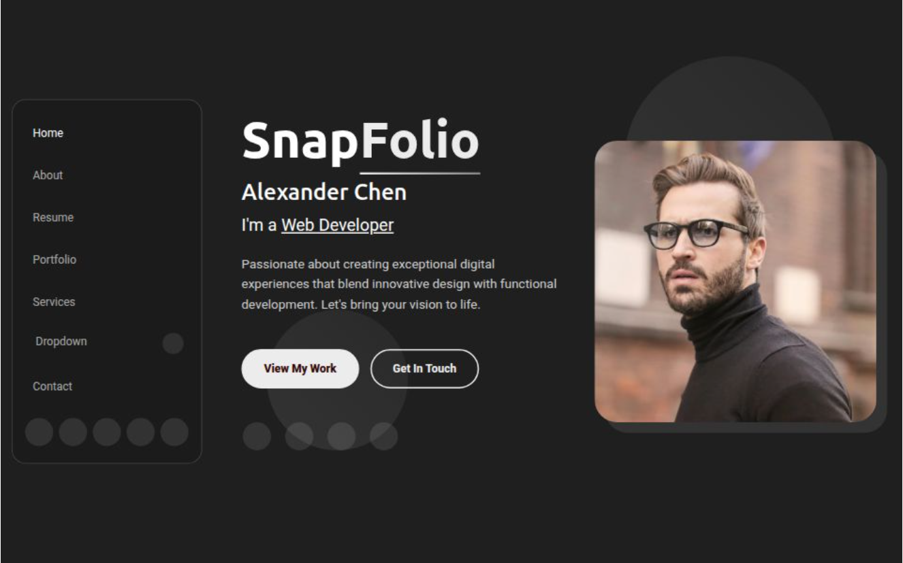

# 📌 PR-BT Portfolio

A modern, responsive **personal portfolio website** built with Next.js and deployed on **Vercel**.  
This portfolio template is perfect for showcasing **skills, projects, services, and contact information** with a clean, professional design.

🔗 **Live Demo**: [https://pr-bt-portfolio.vercel.app/](https://pr-bt-portfolio.vercel.app/)

---

## 📂 Folder Structure

pr-bt-portfolio/
├── public/         # Static assets (images, icons, etc.)
├── pages/          # Next.js page components
├── components/     # Reusable UI components
├── styles/         # Global and component-level styles
├── package.json    # Project dependencies and scripts
└── README.md       # Project documentation

## ✨ Features

- **Responsive Design** – Works seamlessly on mobile, tablet, and desktop devices.
- **Smooth Animations** – Modern transitions for an engaging user experience.
- **Portfolio Showcase** – Filterable gallery to highlight your best work.
- **Services & Testimonials** – Present your offerings and client feedback.
- **Contact Form** – Easy way for visitors to reach you.
- **Fast Deployment** – Hosted on Vercel for speed and reliability.

---

## 🛠 Tech Stack

- **Frontend:** Next.js, React, CSS3, Bootstrap/Custom Styling
- **Hosting:** Vercel
- **Fonts & Icons:** Google Fonts, Bootstrap Icons / Font Awesome

## 📸 Screenshots

